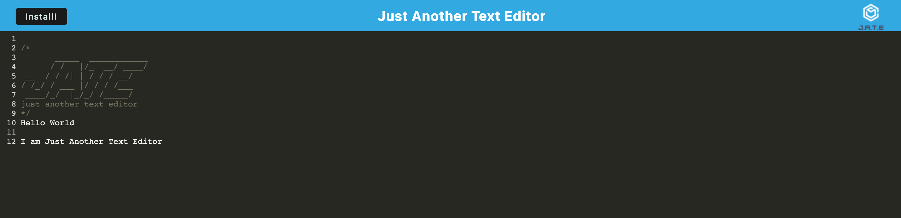

# 19 Progressive Web Applications (PWA): Text Editor

Development build of a PWA (Progressive Web Application)

---

**Table of Contents:**

* [Description](#description)
* [User Story](#user-story)
* [Acceptance Criteria](#acceptance-criteria)
* [Installation](#installation)
* [Testing](#testing)
* [Using the code](#using-the-code)
* [PWA text editor deployment](#pwa-text-editor-deployment)
    * [Deployment Link](#deployment-link)
    * [Screenshot of application](#screenshot-of-deployed-application)
* [Usage](#usage)
* [License](#license) 
* [Questions](#questions)

---

## Description

Taking pre-existing code for a text editor and adding the code to enable installation of the PWA on the local machine. Enabling caching and idb database storage so that both the browser and app version of the text editor can run whilst offine and the data persists and is synced between both. Using WebPack to bundle up dev file into distributable files for deployment.


## User Story


* AS A developer
* I WANT to create notes or code snippets with or without an internet connection
* SO THAT I can reliably retrieve them for later use


## Acceptance Criteria


* GIVEN a text editor web application
* WHEN I open my application in my editor
* THEN I should see a client server folder structure
* WHEN I run `npm run start` from the root directory
* THEN I find that my application should start up the backend and serve the client
* WHEN I run the text editor application from my terminal
* THEN I find that my JavaScript files have been bundled using webpack
* WHEN I run my webpack plugins
* THEN I find that I have a generated HTML file, service worker, and a manifest file
* WHEN I use next-gen JavaScript in my application
* THEN I find that the text editor still functions in the browser without errors
* WHEN I open the text editor
* THEN I find that IndexedDB has immediately created a database storage
* WHEN I enter content and subsequently click off of the DOM window
* THEN I find that the content in the text editor has been saved with IndexedDB
* WHEN I reopen the text editor after closing it
* THEN I find that the content in the text editor has been retrieved from our IndexedDB
* WHEN I click on the Install button
* THEN I download my web application as an icon on my desktop
* WHEN I load my web application
* THEN I should have a registered service worker using workbox
* WHEN I register a service worker
* THEN I should have my static assets pre cached upon loading along with subsequent pages and static assets
* WHEN I deploy to Heroku
* THEN I should have proper build scripts for a webpack application


Challenges in this project: biggest challenge with this project, was getting used to making sure i cleared the cache before running up the appication after every code change. I enjoyed learning how PWAs work and how you can implement idb database and caching to enable apps to function even while offline.


## Installation

Start by downloading the code from the repository, then load in VS code, open a terminal and make sure you are in the project folder.
Initialise the code by typing into the terminal:
```bash
npm i
```

## Using the code

To initialise the code you will need to run the following commands in the terminal to run up the program:

- To get the code running locally you will need to enter into the terminal:
```bash
npm run start
```
and go to

```bash
localhost:3000
```

Once you have finished using the code, be sure to run *(ctrl+C)* or *(^C)* to close down the session.

The code files are fully commented, to explain the flow and logic of the code, so that others can work on this and expand on it too.


## PWA text editor deployment.

### Deployment Link.

<a href="https://pwa-jate-enigmawoman-19.herokuapp.com/"><b>Deployed PWA text editor link</b></a>

### Screenshot of deployed application




## Usage

This code can be used as an example of how to build a PWA using the technologies layed out in the description, if you have any questions or suggestions, please let  know using the links in the [questions](#questions) section of this README.

## License

NA

## Questions

If you have any questions, reach out [@enigmawoman](https://github.com/enigmawoman)</br>


